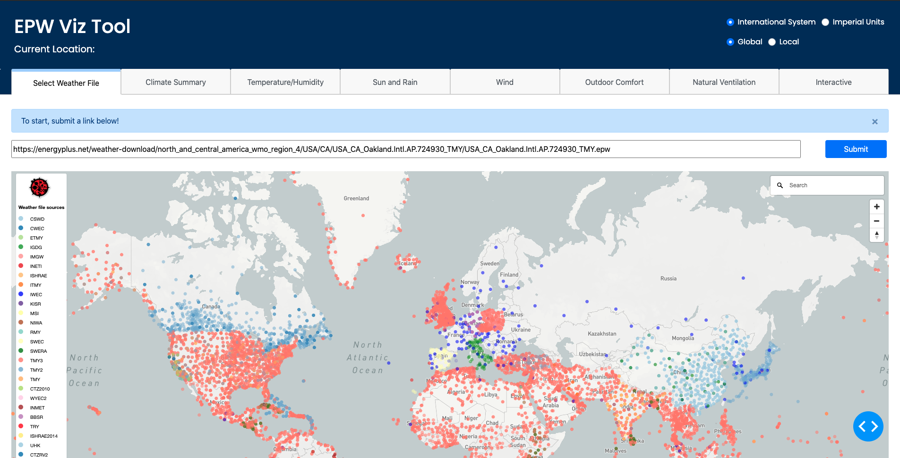
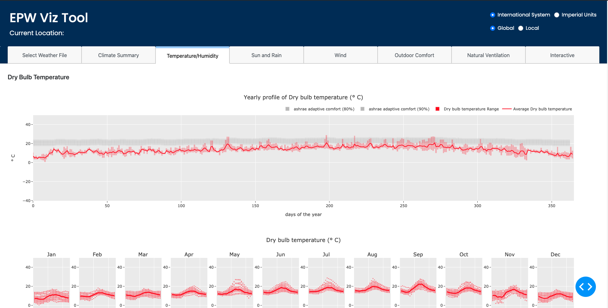

# epw_viz

**Description**
> Display climatic data  

**Built with**
* [Dash] (https://plotly.com/dash/) - Framework for building the web app
* [Plotly Python] (https://plotly.com/python/) - Used to create the interactive plots 

**Install required libraries**
```
!pip install palettable
!pip install -U kaleido
!pip install pythermalcomfort
```

**How to run this app**
```
git clone https://github.com/chrlng/epw_viz
cd epw_viz
python3 run.py
```

**Landing Page**

**Tab 3**

