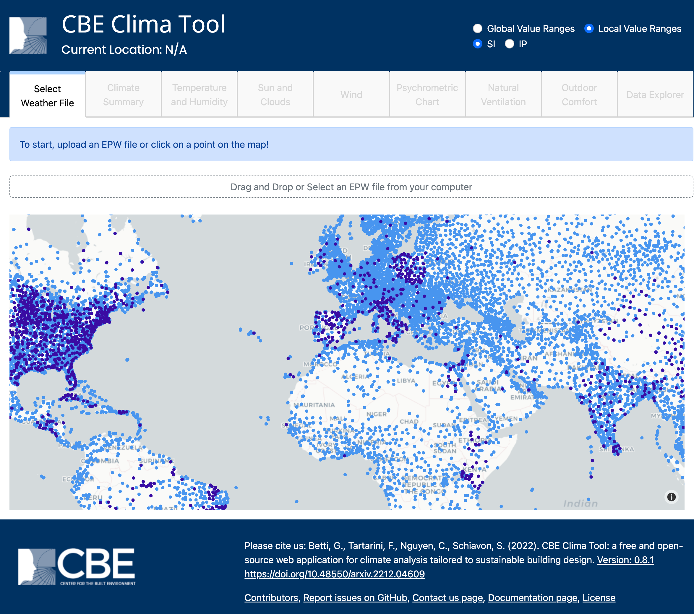

# CBE Clima Tool

The CBE Clima Tool is a web-based application built to support climate analysis specifically designed to support the need of architects and engineers interested in climate-adapted design. It allows users to analyze the climate data of more than 27,500 locations worldwide from both [Energy Plus](https://energyplus.net/weather) and [Climate.One.Building.org](http://climate.onebuilding.org/). You can, however, also choose to upload your own EPW weather file. Our tool can be used to analyze and visualize data contained in EnergyPlus Weather (EPW) files. It furthermore calculates a number of climate-related values (i.e. solar azimuth and altitude, Universal Thermal Climate Index (UTCI), comfort indices, etc.) that are not contained in the EPW files but can be derived from the information therein contained. It can be freely accessed at [clima.cbe.berkeley.edu](http://clima.cbe.berkeley.edu)

If you use this tool please consider citing us.

The CBE Clima Tool is open source. We have released the source code on a [public repository](https://github.com/CenterForTheBuiltEnvironment/clima). We welcome contributions from the community ([more info here](contributing/contributing.md)).

## Contributions

This ongoing project results from the collaboration and contributions of the people listed below.

* [Giovanni Betti](https://www.linkedin.com/in/gbetti/): Conceptualization, methodology, coding, review, supervision, and project administration
* [Federico Tartarini](https://www.linkedin.com/in/federico-tartarini-3991995b/): Methodology, coding, review, supervision, and code maintenance
* [Stefano Schiavon](https://www.linkedin.com/in/stefanoschiavon/): Conceptualization, review, supervision, project administration, and funding acquisition
* [Roberto Rugiani](https://www.linkedin.com/in/roberto-rugani/): Documentation
* [Christine Nguyen](https://chrlng.github.io/): Coding and methodology
* Yunzhu Ji: Coding and review
* [Daniel Harris](https://www.linkedin.com/in/daniel-harris-4005a5a2/): Coding and review
* [Chun Him Lee](https://www.linkedin.com/in/chun-him-lee-01b553129/): Coding and review
* [Tu Minh Phuong Doan](https://www.linkedin.com/in/harry-doan-legopher/): Coding and review
* [Yixun Quan](https://www.linkedin.com/in/yixun-quan-929a661a3): Coding and review

## Acknowledgment

We would like to thank for their valuable feedback and support: Ed Arens, Dru Crawley, David Lehrer, Noah Pitts, and Hui Zhang. [Clima](https://clima.cbe.berkeley.edu/) has been supported by the [Centre for the Built Environment at UC Berkeley](https://cbe.berkeley.edu/) at the University of California Berkeley and the Republic of Singapore's National Research Foundation for [SinBerBEST](https://sinberbest.berkeley.edu) Program.

<figure><figcaption>
CBE Clima tool home page
</figcaption></figure>

## License

[The CBE Clima Tool is licensed under a Creative Commons Attribution-Commercial 4.0 International License (CC BY 4.0)](https://creativecommons.org/licenses/by/4.0/)
