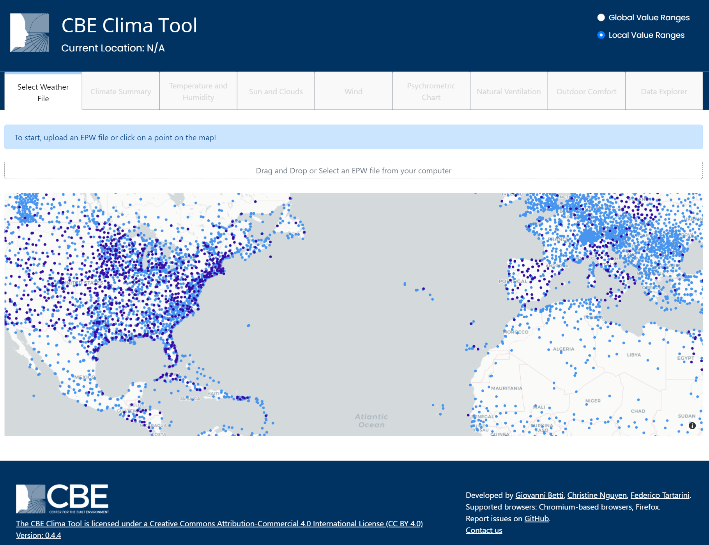

# CBE Clima Tool

The CBE Clima Tool is a web application that gives you direct access to high-quality visualization of almost 30,000 worldwide weather files from both[ Energy Plus](https://energyplus.net/weather) and[ Climate.One.Building.org](http://climate.onebuilding.org/). You can, however, also choose to upload your own EPW weather file.

If you use this tool please consider citing our tool.

The CBE Clima Tool is open source and we have released the source code on a [public repository](https://github.com/CenterForTheBuiltEnvironment/clima). We welcome people who want to contribute to our project \([more info here](contributing/contributing.md)\).

This documentation website contains information on how to use our tool. 

The tool was developed by: Giovanni Betti, [Christine Nguyen](https://chrlng.github.io/),[ Federico Tartarini](https://www.linkedin.com/in/federico-tartarini-3991995b/). We also would like to thank [Stefano Schiavon](https://ced.berkeley.edu/ced/faculty-staff/stefano-schiavon) for his guidance and support.

