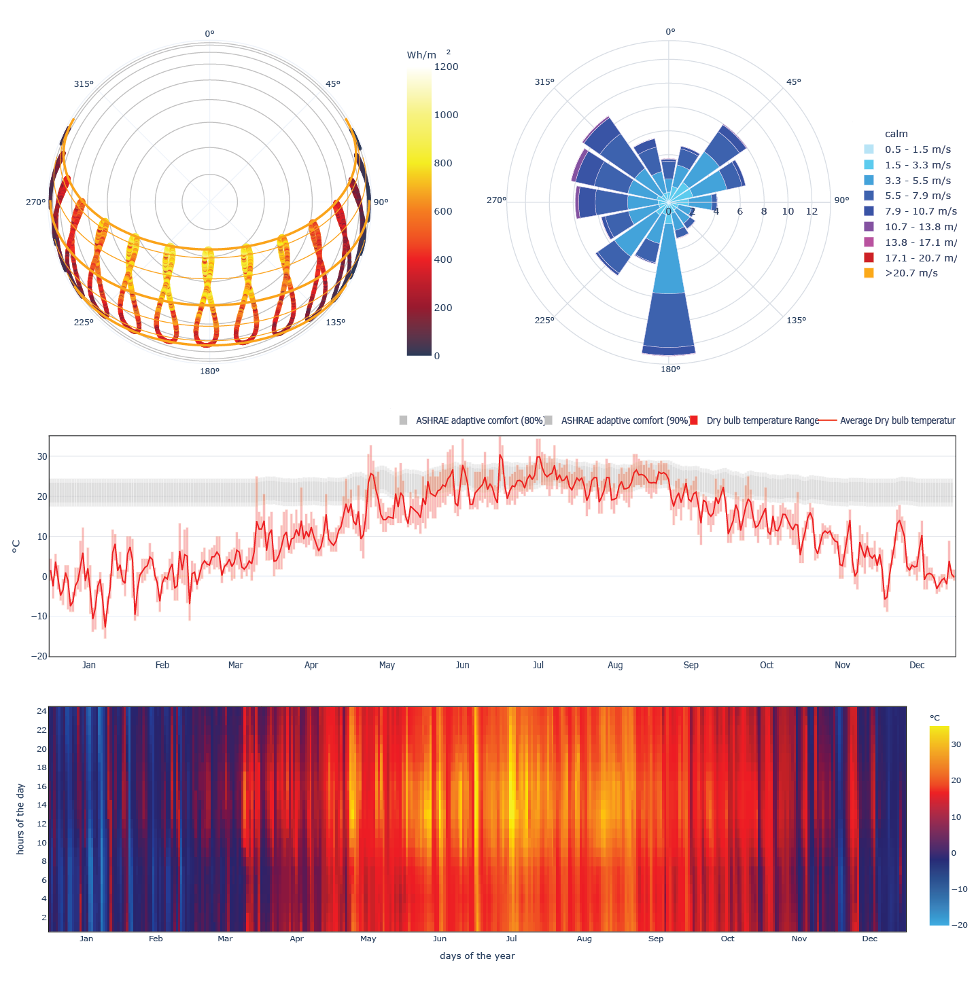

# Overview

The CBE Clima Tool allows users to analyze and visualize climatic data. Via a map-based interface, our tool allows the users to easily access EPW files for circa 30,000 locations worldwide from two online repositories the [Energy Plus](https://energyplus.net/weather) and [Climate.One.Building.org](http://climate.onebuilding.org/). In addition, users can upload into our tool their own EPW file.

Users can download:

* all the charts and figures in Scalable Vector Graphics \(SVG\);
* the data from the EPW file or those we used in the tool to generate the plots in Comma-Separated Values \(CSV\) format.

When displaying the variables in the interactive plots users can either select to use the Global or Local Value Ranges. The `Global` option uses preset limits for the chart axes, chosen to cover the vast majority of the climatic ranges to be found on planet Earth. This allows the user to easily compare charts generated for any two different locations. The `Local` option sets the upper and lower limits of the chart axes as a function of the data contained in the EPW file.

