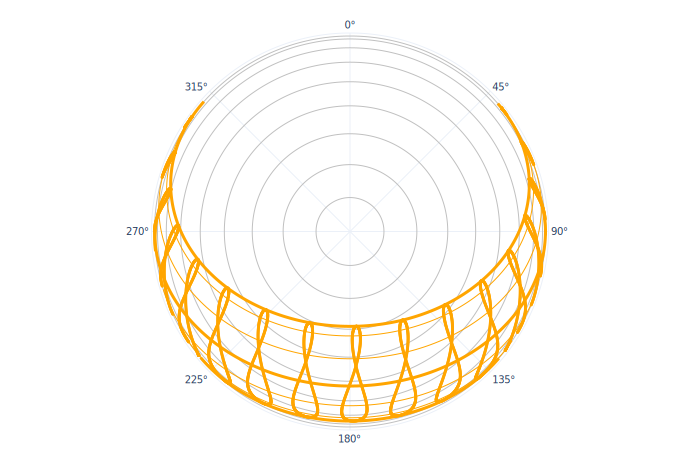

# Sun and Cloud

### Sun and Cloud

The Sun and Clouds tab presents an overview of various climatic factors that relate to sun, solar position, intensity nad cloud cover, in particular: 

* [Apparent sunpath for the location \(spherical and cartesian projection\)](apparent-sunpath-for-the-location/)
* [Global and Diffuse Horizontal Solar Radiation](global-and-diffuse-horizontal-solar-radiation/)
* [Cloud coverage](cloud-coverage.md)
* [Customizable daily and hourly maps](customizable-daily-and-hourly-maps.md)

### Apparent sunpath for the location

**Clima** allows the user to visualize the sunpath for the chosen location in spherical and cartesian projection

