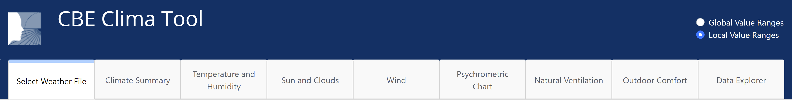

# Tabs Explained

The Clima app is organized in a series of tabs that allow the exploration of various topics. All the tabs other than "Select Weather File" are active after a weather file has been selected.

Although there is a logical sequence in the organization of the tabs, thy can be accessed in any order. &#x20;

The Followin section will explain the content and the usage of each tab.

