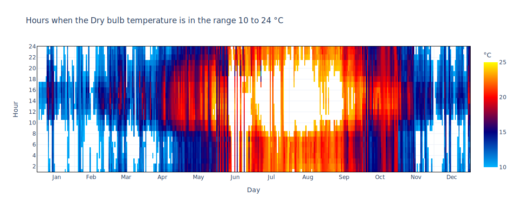
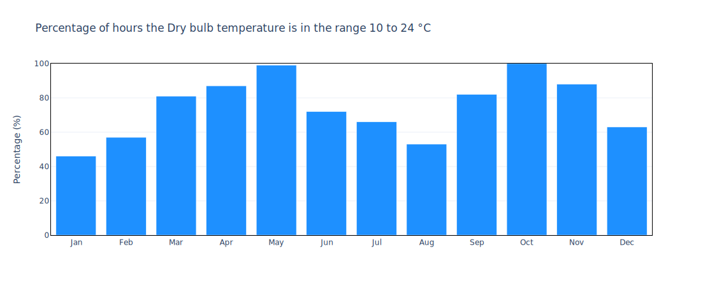

# Natural Ventilation Potential

**Clima** allows an estimation of the hours when indoor environments can be ventilated with outside air depending on the external temperature.

[Natural ventilation](https://en.wikipedia.org/wiki/Ventilation\_\(architecture\)) is the process of introducing outdoor air into a building from the outside to improve air quality, provide fresh air and/or comfort cooling without actively conditioning the incoming airstream. Hourly air changes are required by most building regulations to ensure a healthy and smell-free environment, usually set at a minimum of one volume exchanged per hour.

In favorable climates and building types, natural ventilation can be used in combination with or as an alternative to air conditioning systems.

**Clima** Natural Ventilation Potential assessment is based primarily on outdoor temperatures. Natural ventilation is assumed to be possible when the outdoor air temperature is below the indoor comfort threshold and above a minimum to avoid drafts.

The maximum temperature threshold can be estimated depending on the internal loads, how many people are in the room, and how many electrical appliances. Considering the desired indoor air setpoint temperature, it can be dropped by 2 or 3 °C based on how much heat needs to be removed from the interior.

The minimum temperature threshold is typically dictated by local discomfort near the fresh air inlet source. The minimum limit to be considered may be as low as 10 °C, but a typically used value to minimize the risk of draft is 15 °C.

**Clima** shows by default a heatmap with all hours when the temperature is between 10 and 24 °C and a bar chart with the number of hours in which the filter was successful. The bar chart can be normalized, then displayed as a percentage of total monthly hours, or simply plotted with the total sum of the filtered hours.

<figure><figcaption>
Example: annual dry bulb temperature heatmap between 10 and 24 °C for <strong>Barcelona, SPA</strong>
</figcaption></figure>

<figure><figcaption>
Example: count of annual dry bulb temperature between 10 and 24 °C for <strong>Barcelona, SPA</strong>
</figcaption></figure>

**Clima** provides various options to customize the natural ventilation potential calculations for individual projects:

* setting the minimum and maximum outdoor air temperatures to be considered;
* selecting the time of the day or months to be analyzed;
* assessing eventual condensation risks on chilled surfaces (i.e. radiant chilled panels)

Natural ventilation can be used in combination with and in aid of radiant cooling systems. The most common risk is that condensation will form on cold surfaces, creating slippery floors or potential mold. **Clima** allows this control to be performed with the "surface temperature" filter, which is a function of the dew temperature.

_\[video as for psychometric chart]_
