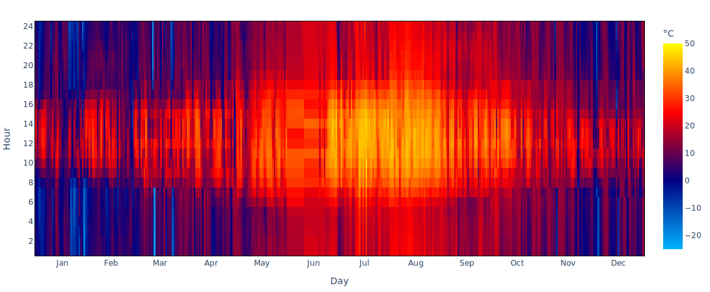
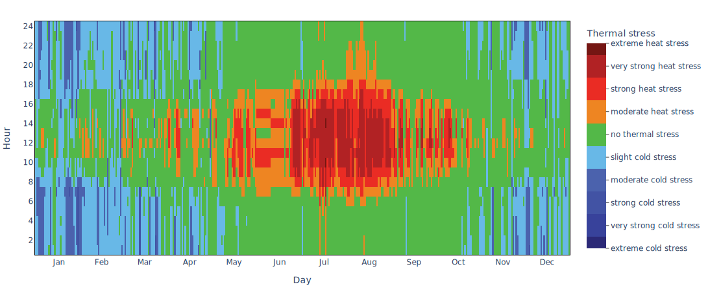

# Outdoor Comfort

The **Outdoor Comfort** tab shows an overview of the perceived environmental condition based on the UTCI model.

The [Universal Thermal Climate Index](http://www.utci.org/index.php) (UTCI), introduced in 1994, aims to be the measure of human physiological reaction to the atmospheric environment.&#x20;

<figure><figcaption>
Graphical scheme of the UTCI calculation methodology
</figcaption></figure>

It considers:

* &#x20;dry bulb temperature
* mean radiant temperature
* wind speed
* relative humidity

&#x20;to calculate a reference environmental temperature causing strain when compared to an individual's response to the real environment. It is based on [Fiala et al](https://link.springer.com/article/10.1007/s00484-011-0424-7).'s multi-node model of thermo-regulation.

The [UTCI equivalent temperature](https://doi.org/10.1016/j.wace.2018.01.004) is a function of the above parameters, which are combined in a multinode thermo-physiological model that takes into account clothing insulation and metabolic rate. From this a[Universal Thermal Climate Index](http://www.utci.org/index.php) (UTCI) of perceived thermal stress is derived.

**Clima** allows the user to visualize the annual UTCI equivalent temperature as heatmap under various environmental conditions.

<figure><figcaption>
Example: UTCI perceived temperature annual heatmap in 'Sun and Wind' conditions for <strong>Rome, ITA</strong>
</figcaption></figure>

The UTCI temperature can be converted in a scale assessing thermal stress, displayed by **Clima** in a heatmap graph.

<figure><figcaption>
Example: UTCI heat stress index heatmap in 'Sun and Wind' conditions for <strong>Rome, ITA</strong>
</figcaption></figure>
