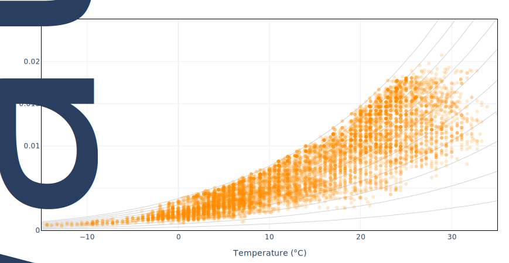

# Psychrometric Chart

**Clima** allows the user to visualize all annual weather conditions on a [psychometric diagram.](psychrometric-chart-explained.md)&#x20;

The default diagram allows the users to overlay the frequency with which weather conditions recur throughout the year.

<figure><figcaption>
Example: Frequency of climatic condition in the Psychrometric chart of <strong>New York, USA</strong>
</figcaption></figure>

With the first choice in the drop-down list, "None", it is possible to view temperature conditions in the psychometric diagram over the entire year. The visualized dots have the same gradient with a transparency rate, they are not colored according to a legend. Multiplying them when overlaid provides a visualization of their frequency, so the most common conditions.

<figure><figcaption>
Example: Psychrometric chart with climatic conditions of <strong>New York, USA</strong>
</figcaption></figure>

Then, users can overlay another variable on the graphs, choosing from [Clima dataframe](../tab-summary/clima-dataframe.md).

<figure><figcaption>
Example: Psychrometric charts with different variables (from top left to bottom right): dry bulb temperature, relative humidity, global horizontal radiation, and wind speed
</figcaption></figure>

Moreover, data can be filtered by date, time, or one of the [Clima dataframe](../tab-summary/clima-dataframe.md) variables.

<figure><figcaption>
Psychrometric charts filters
</figcaption></figure>
