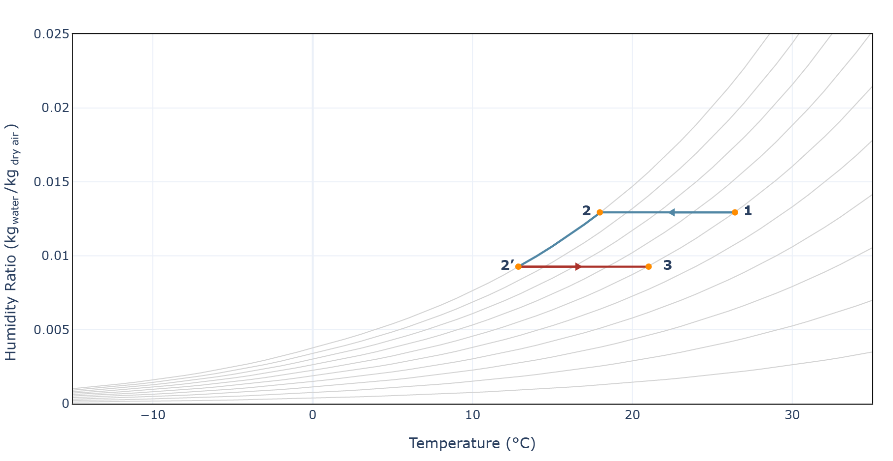

# How to read a Psychrometric Chart

A [psychrometric diagram](https://en.wikipedia.org/wiki/Psychrometrics) is a psychrometry tool used to understand the relationship between humidity and air temperature conditions. Through the use of the psychrometric diagram and appropriate calculations, it is possible to know the amount of heat or cooling needed to achieve the desired temperature and humidity.

The **Clima** psychometric diagram shows dry bulb temperature on the abscissae, specific humidity on the ordinates, and relative humidity as parametric curves inside the graph.

<figure><figcaption>
Temperature line in the Psychrometric diagram
</figcaption></figure>

The [humidity ratio](https://en.wikipedia.org/wiki/Humidity) is the water vapor's weight per unit weight of dry air, the so-called specific humidity. It is important not to confuse it with [relative humidity](../temperature-and-humidity/relative-humidity-explained.md). The same specific humidity value can have different relative humidity conditions by changing the air temperature.

<figure><figcaption>
Humidity ratio line in the Psychrometric diagram
</figcaption></figure>

All air conditions cannot go beyond the 100% saturation curve, which means that the air contains the maximum amount of water vapor, in certain conditions of temperature ad pressure.

<figure><figcaption>
Relative humidity curves in the Psychrometric diagram
</figcaption></figure>

The simplest transformation to be analyzed on the psychometric diagram is the heating and cooling processes. The transition from the starting condition (1) to the final one (2) occurs horizontally, at constant humidity ratio values. The final condition (2) can be inspected as a function of the starting one.

<figure><figcaption>
Cooling and heating process
</figcaption></figure>

A common application of the diagram is humidification and dehumidification of environments, where the saturation curve is used. The air is cooled to [dew temperature](https://en.wikipedia.org/wiki/Dew\_point) (2), and then heat continues to be removed, so condensing some of the vapor and decreasing the specific humidity until the desired value (2'). Therefore, a post-heating process could bring the air back to the starting relative humidity (3).

<figure><figcaption>
Dehumidification and post-heating process
</figcaption></figure>

The main application of the psychrometric diagram is in the design of large all-air systems. The air we breathe is differentiated into dry air and humid air. Humid air, which is what is analyzed in the psychrometric diagram, is composed of dry air and water vapor. Thanks to the diagram, we can run the HVAC system on heating/cooling air and mixing humid and dry air, and know exactly what temperature and relative humidity conditions we will obtain. For instance, an adiabatic mixing of air in the two starting conditions (1-2) will obtain a new mixture (3).

<figure><figcaption>
Adiabatic air mixing process
</figcaption></figure>

The diagram is applied whenever the humidity of a particular environment needs to be studied, for reasons of thermal comfort or for the preservation of valuable objects, such as in museums.

<figure><figcaption>
Stradivari Violin, stored under precise temperature and humidity conditions to prevent the valuable wood from warping.      Source: <a href="https://www.frammentirivista.it/il-clisbee-il-prezioso-violino-di-stradivari/">Frammentirivista</a>
</figcaption></figure>
