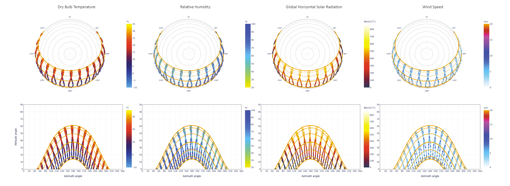

# Sun and Clouds

The **Sun and Clouds** tab presents an overview of various climatic factors that relate to sun, solar position, intensity, and cloud cover, in particular:&#x20;

* [Apparent sunpath for the location (spherical and cartesian projection)](broken-reference)
* [Global and Diffuse Horizontal Solar Radiation](global-and-diffuse-horizontal-solar-radiation/)
* [Cloud coverage](cloud-coverage.md)
* [Customizable daily and hourly maps](customizable-daily-and-hourly-maps.md)

### Apparent sun path for the location

**Clima** allows the user to visualize the sun path for the chosen location in spherical and cartesian projection

Clima optionally allows a variety of variables to be overlayed on either sun path type.

This allows the user to identify climatic patterns in relation to the apparent solar position. Data are plotted on the analemma.

