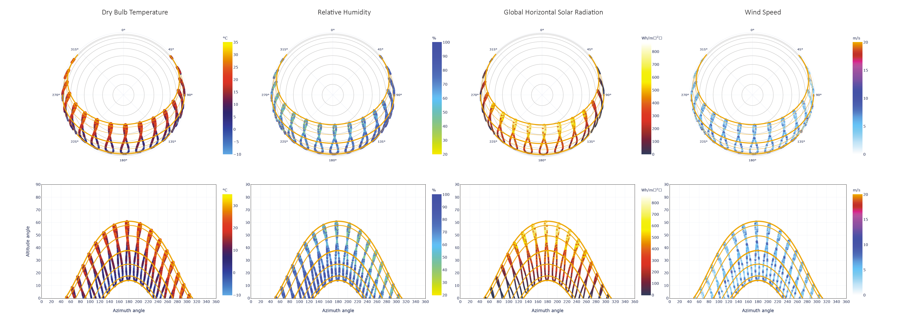

# Apparent sunpath for the location

### Sun and Cloud

**Clima** allows the user to visualize the sunpath for the chosen location in spherical and cartesian projection.

Clima optionlly allows a variety of variables to be overlayed on the either sunpath type.

This allows the user to identify climatic patterns in relation to the apparent solar position. Data are plotted on the annalemma.

The variables that can be overlayed on the sunpath are:

* [Dry Bulb Temperature ](https://bigladdersoftware.com/epx/docs/8-3/auxiliary-programs/energyplus-weather-file-epw-data-dictionary.html#field-dry-bulb-temperature)
* [Dew Point Temperature ](https://bigladdersoftware.com/epx/docs/8-3/auxiliary-programs/energyplus-weather-file-epw-data-dictionary.html#field-dew-point-temperature)
* [Relative Humidity ](https://bigladdersoftware.com/epx/docs/8-3/auxiliary-programs/energyplus-weather-file-epw-data-dictionary.html#field-relative-humidity)
* [Atmospheric Pressure ](https://bigladdersoftware.com/epx/docs/8-3/auxiliary-programs/energyplus-weather-file-epw-data-dictionary.html#field-atmospheric-station-pressure)
* [Extraterrestrial Horizontal Radiation ](https://bigladdersoftware.com/epx/docs/8-3/auxiliary-programs/energyplus-weather-file-epw-data-dictionary.html#field-extraterrestrial-horizontal-radiation)
* [Extraterrestrial Direct Normal Radiation ](https://bigladdersoftware.com/epx/docs/8-3/auxiliary-programs/energyplus-weather-file-epw-data-dictionary.html#field-extraterrestrial-direct-normal-radiation)
* [Horizontal Infrared Radiation ](https://bigladdersoftware.com/epx/docs/8-3/auxiliary-programs/energyplus-weather-file-epw-data-dictionary.html#field-horizontal-infrared-radiation-intensity)
* [Global Horizontal Radiation ](https://bigladdersoftware.com/epx/docs/8-3/auxiliary-programs/energyplus-weather-file-epw-data-dictionary.html#field-global-horizontal-radiation)
* [Direct Normal Radiation ](https://bigladdersoftware.com/epx/docs/8-3/auxiliary-programs/energyplus-weather-file-epw-data-dictionary.html#field-direct-normal-radiation)
* Diffuse Horizontal Radiation 
* Global Horizontal Illuminance 
* Direct Normal Illuminance 
* Diffuse Horizontal Illuminance 
* Zenith Luminance 
* Wind Direction 
* Wind Speed 
* Total Sky Cover 
* Opaque Sky Cover 
* Visibility

