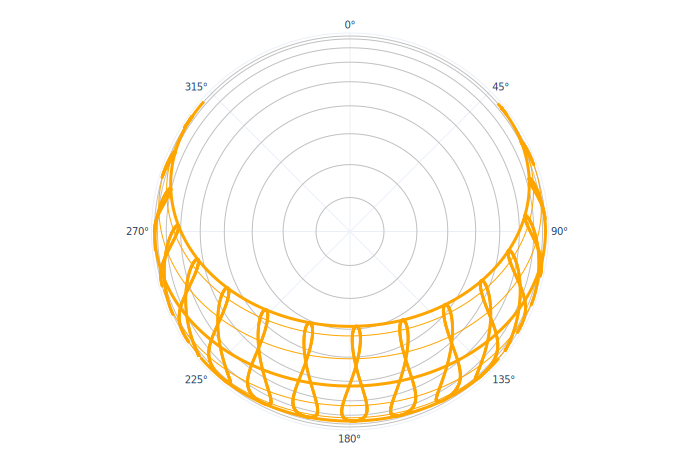

# Apparent sunpath for the location

### Sun and Cloud

**Clima** allows the user to visualize the sunpath for the chosen location in spherical and cartesian projection.

Clima optionlly allows a variety of variables to be overlayed on the either sunpath type.

This allows the user to identify climatic patterns in relation to the apparent solar position. Data are plotted on the annalemma.

The full lists of variables that can be overlayed on the sunpath is:

* lfäkbnadkln
* kfnbldfbn
* äsfknblkdfn
* ökfjbnf

