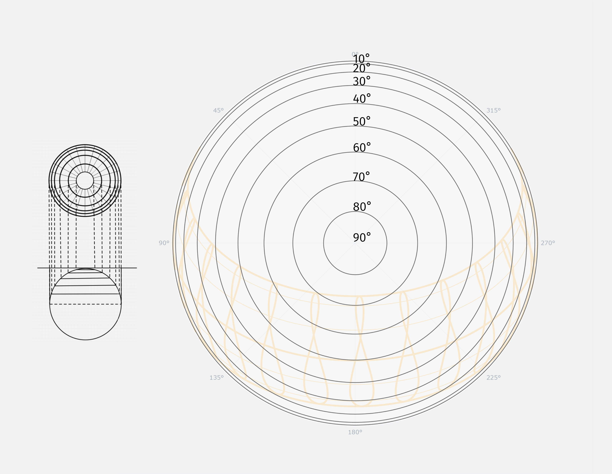
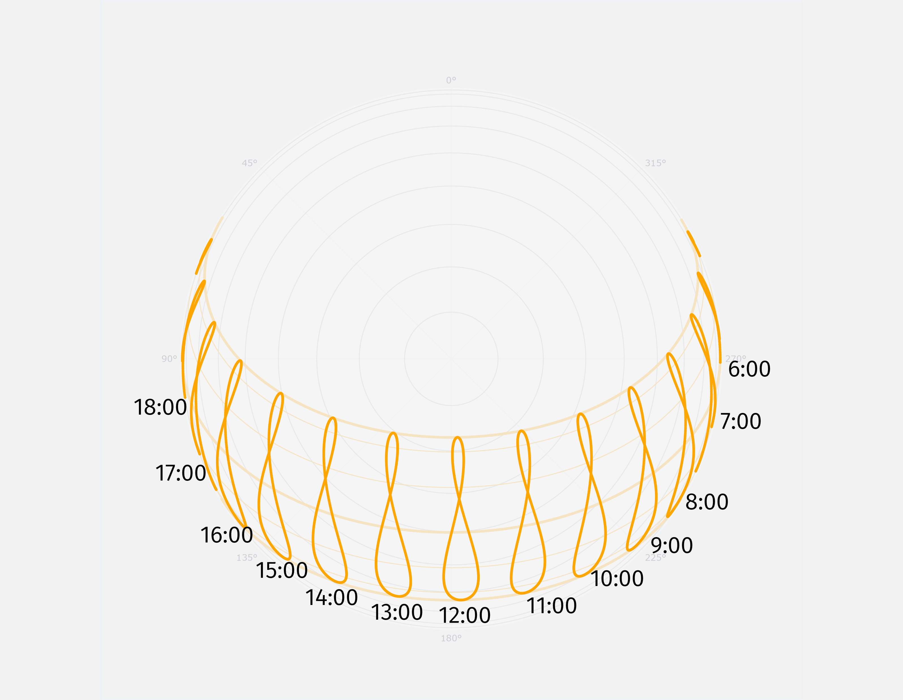

# How to read a spherical sun path diagram

The spherical sunpath is comprised of various graphica elements overlayed on one another.

We'll attempt to describe them individually below.

The sunpath can be read as a compass, with the radial lines indicating the different directions.

The concentric circles can be understood as sections of the immaginary sky dome. Each ring represents an increment of 10 degreees from the horizon. As such, they help visualize the solar altitude for each sun position.

