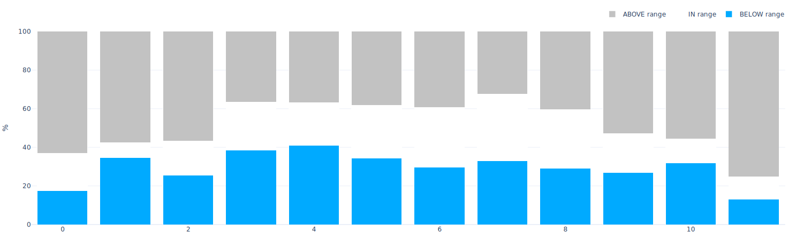

# Cloud coverage

The cloud coverage diagram reports, for every month of the year the frequncy of "clear", "cloudy" or "intermediate" conditions.

As the Cloud cover is reported in tenths of coverage \(i.e. 1 is 1/10 covered. 10 is total coverage\) for the purpose of this graph we have simplified the scale as per the table below. 

| Categorization | Color | Tenth of coverage |
| :--- | :--- | :--- |
| Clear \(BELOW range\)  |   | 1 |
| Clear \(BELOW range\)  |   | 2 |
| Clear \(BELOW range\)  |   | 3 |
| Intermediate \(IN range\) |  | 4 |
| Intermediate \(IN range\) |  | 5 |
| Intermediate \(IN range\) |  | 6 |
| Intermediate \(IN range\) |  | 7 |
| Cloudy \(ABOVE range\)  |   | 8 |
| Cloudy \(ABOVE range\) |   | 9 |
| Cloudy \(ABOVE range\) |   | 10 |

