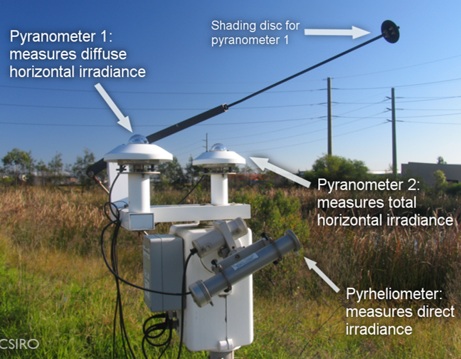
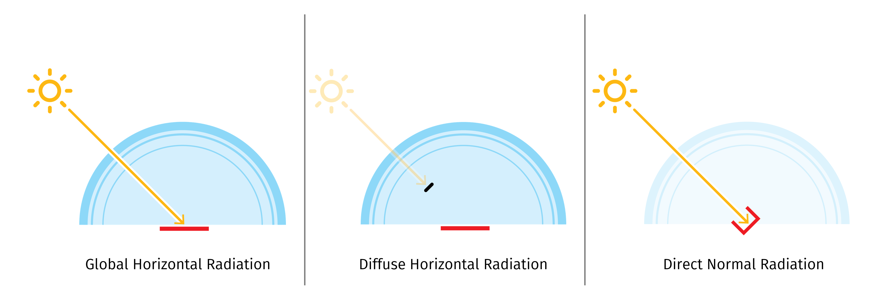

# Global, Diffuse and Normal solar radiation explained

* **Global Horizontal Irradiance (GHI)** is the total irradiance from the sun on a horizontal surface. It is the sum of the Diffuse Horizontal Irradiance and the Direct Normal Irradiance, projected onto the horizontal plane using the [solar zenith angle](https://en.wikipedia.org/wiki/Solar\_zenith\_angle) (z).

$$
GHI = DHI + DNI * cos(z)
$$

* **Diffuse Horizontal Irradiance (DHI)** is the radiation that arrives from the entirety of the sky dome, except the solar disc. Is the radiation that has been scattered by molecules and particles in the atmosphere.  It is measured on a horizontal surface
* **Direct Normal Irradiance (DNI)** is the measurement of the intensity of sunlight on a surface perpendicular (normal) to the sun, as such, in very clear sky conditions and low solar altitudes, the Direct Normal Irradiance can be higher than the Global Horizontal Irradiance.

