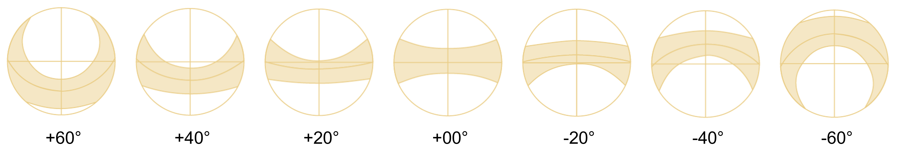
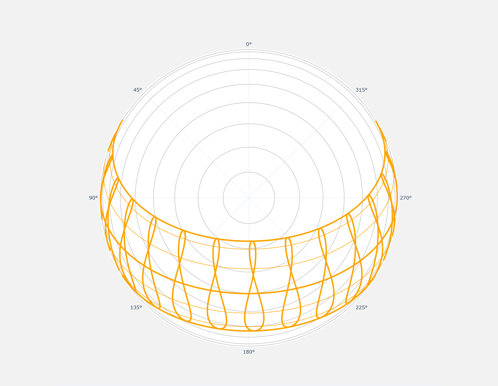
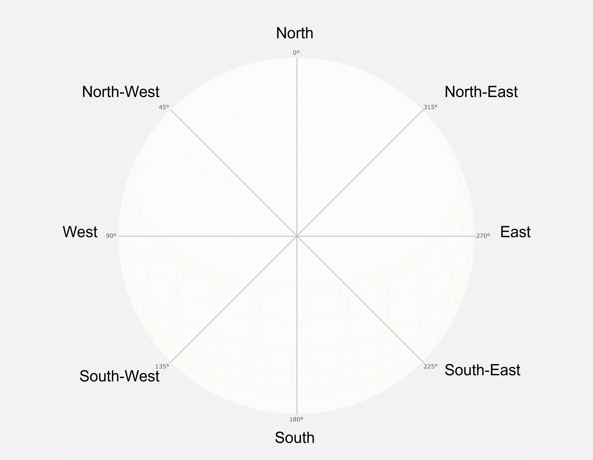
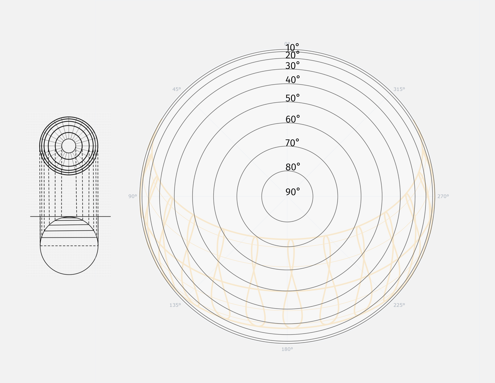
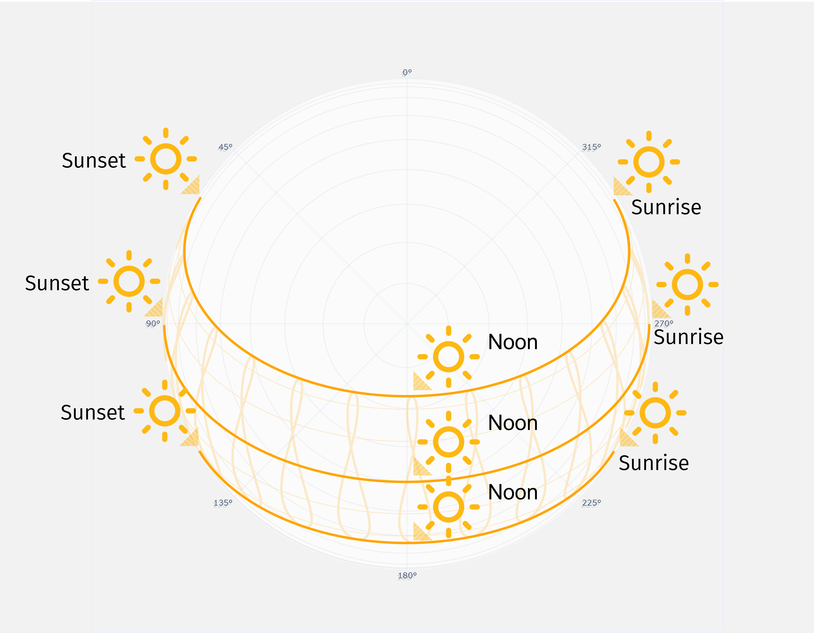
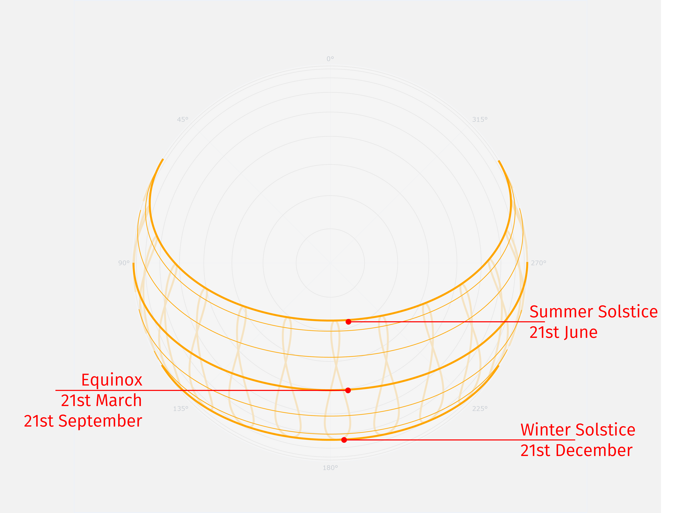
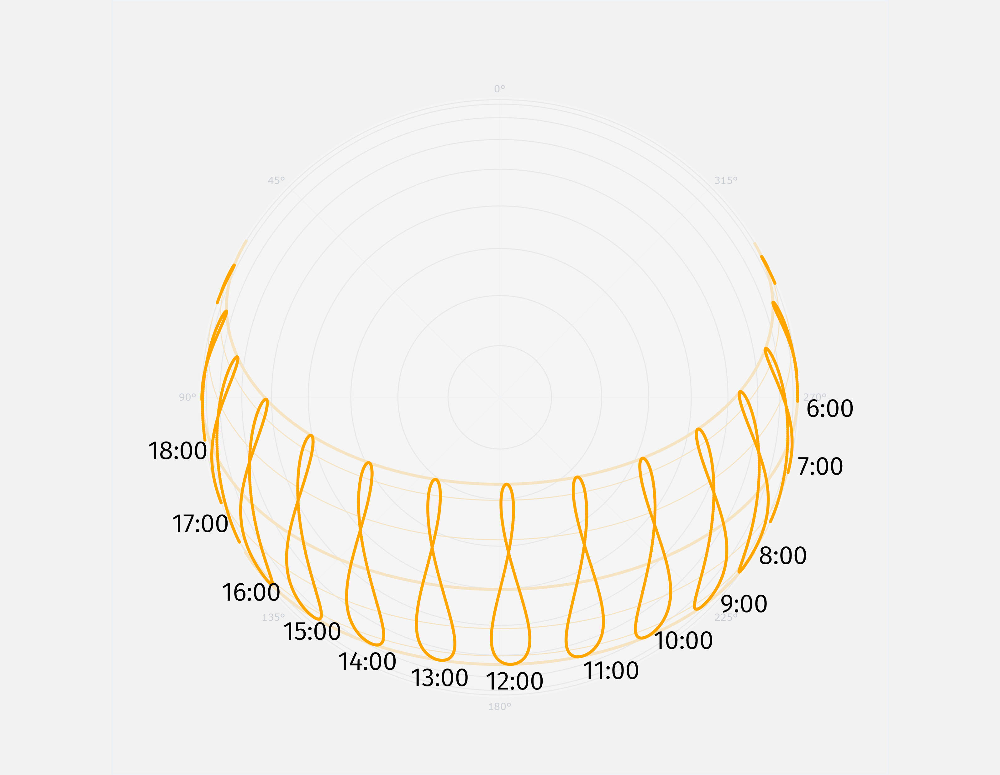

# How to read a spherical sun path diagram

The spherical sun path is comprised of various graphical elements overlayed on one another.

We'll attempt to describe them individually below.

The sunpath can be read as a compass, with the radial lines indicating the different directions.

The concentric circles can be understood as sections of the immaginary sky dome. Each ring represents an increment of 10 degreees from the horizon. As such, they help visualize the solar altitude for each sun position.

The daily path of the sun on a given day can be traced by following a sun path spline from the east (sunrise) to the west (sunset).

The upper spline represents the sun's path during the summer solstice, i.e. the maximum height of the sun above the horizon for the examined location. Meanwhile, the lower spline is the sun’s path during the winter solstice, when the sun reaches the lowest height above the horizon. The spline in the middle is the sun's path during the Equinoxes.

Gathering the sun's positions for each time of day, during all days of the year, creates splines called [Analemmas](https://en.wikipedia.org/wiki/Analemma).

Overlapping photos taken at the same time of day over the course of an entire year results in an analemma like the one in the picture.

