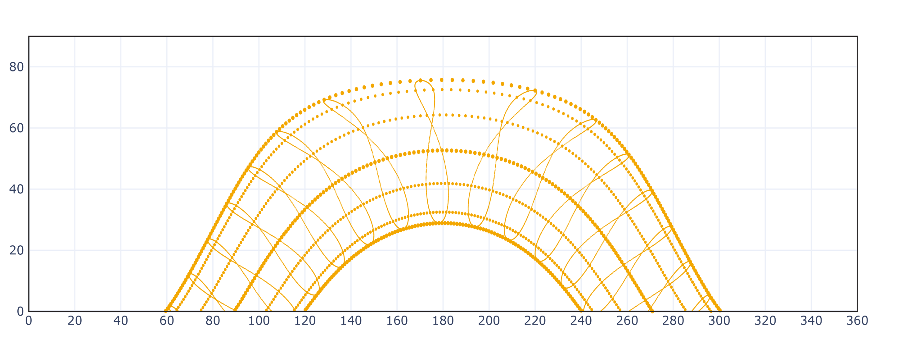
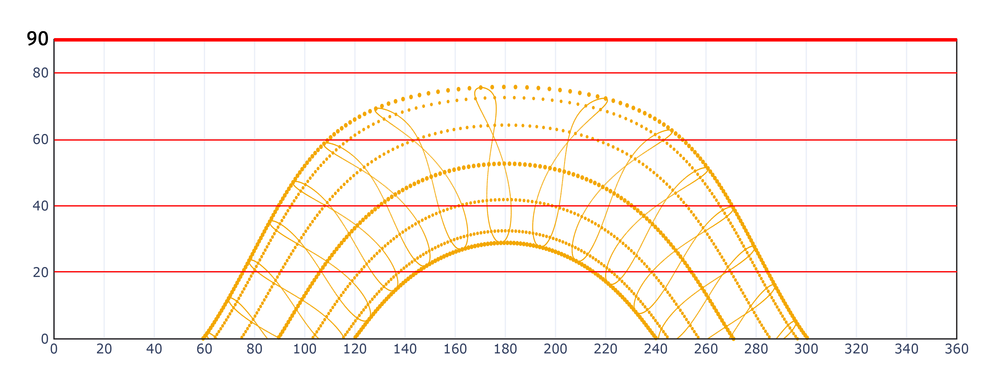
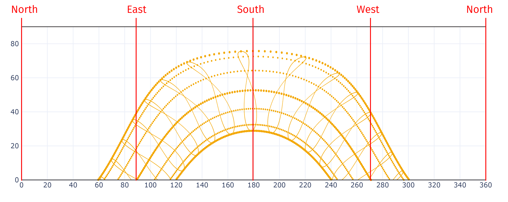
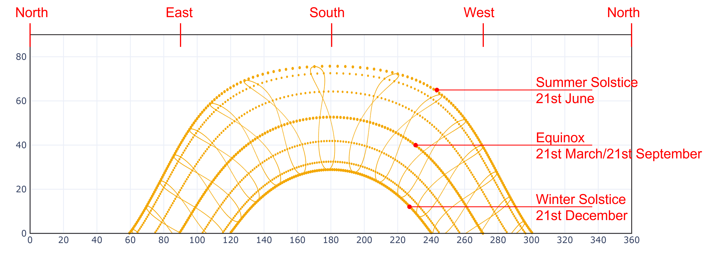

# How to read a cartesian sun path diagram

In the cartesian coordinates, the solar elevation is plotted on the y-axis and the azimuth is plotted on the x-axis. It shows the path we would see the sun follow if we took a video with the camera in the right direction of the horizon (as notable comparing the following two figures).

A photographic paper left inside a cider exposed through a pinhole aperture captured 8 years of sun full cycles. The photographic paper immortalized a real cartesian sun path.

The cartesian sun path is comprised of various graphical elements overlayed on one another.

We'll attempt to describe them individually below.

The cartesian sun path can be read as a [projection](https://en.wikipedia.org/wiki/Map\_projection#Cylindrical) of the spherical sun path diagram.\
The map projection encompasses a wide range of transformations used to represent the curved two-dimensional surface of a globe on a plane. The cylindrical projection is obtained by unraveling the globe inside a cylinder. Among the different distortion versions of the globe in a flat map, the [Miller Projection](https://en.wikipedia.org/wiki/Miller\_cylindrical\_projection) is a compromise that does not sacrifice either area or map shapes excessively at the extremes.

The planes parallel to the x-axis can be understood as sections of the imaginary sky dome. Each plane represents an increment of 10 degrees from the horizon. Thereby, it is possible to read the height of the sun in each of its positions.

The geographical coordinates are plotted on the x-axis in degrees, going from left to right: North (0°), East (90°), south (180°), and West (270°).

The upper spline represents the sun's path during the summer solstice, i.e. the maximum height of the sun above the horizon for the examined location. Meanwhile, the lower spline is the sun’s path during the winter solstice, when the sun reaches the lowest height above the horizon. The spline in the middle is the sun's path during the Equinoxes.
