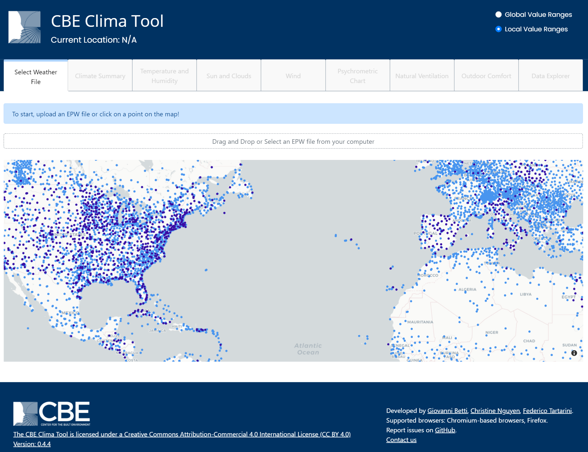

# Select Weather File

Users can either choose to analyse the climate of the locations displayed on the map or upload a custom EPW file. After loading an EPW file the user can then access the other tabs to generate dynamic visualisations of the data.

