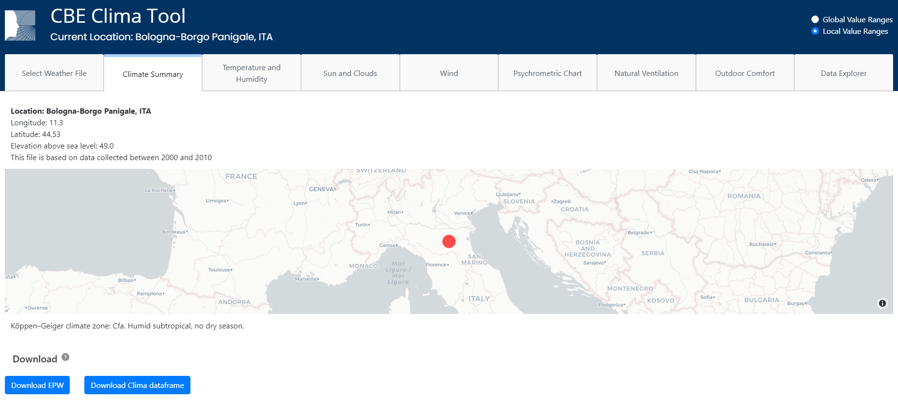
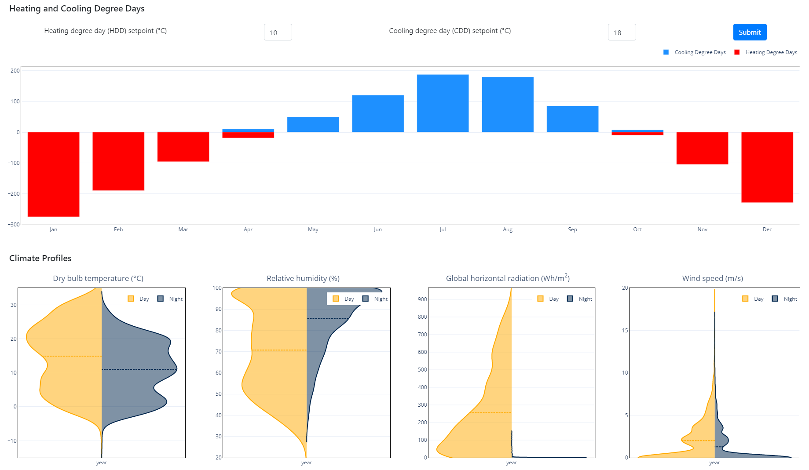

# Climate Summary

The top section of the page provides information about the selected location such as longitude, latitude, and [Koppen-Geiger](https://en.wikipedia.org/wiki/K%C3%B6ppen\_climate\_classification) climate zone. Via this page, the user can also download the EPW data and the [`Clima Dataframe`](clima-dataframe.md) used to generate the plots, as shown below.

The bottom section of the page comprises the heating and cooling degree day chart and four violin plots showing the distribution of the dry-bulb air temperature (Tdb), relative humidity (RH), Global Horizontal Irradiance (GHI), and wind speed (U).

