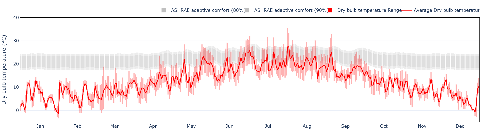
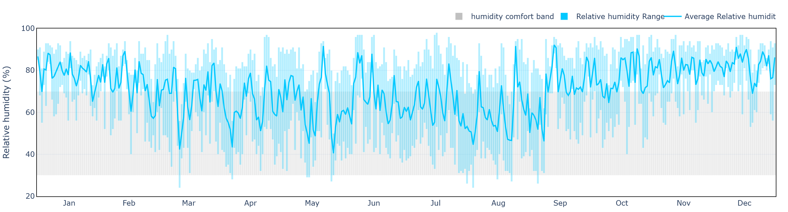
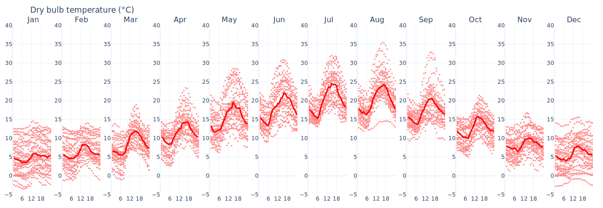
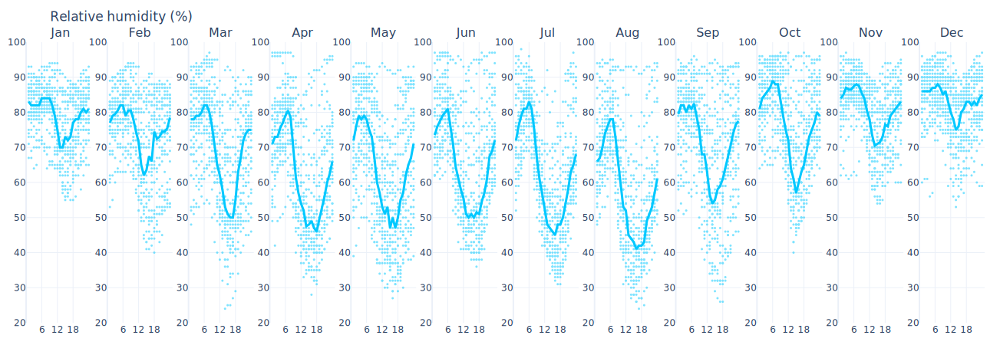
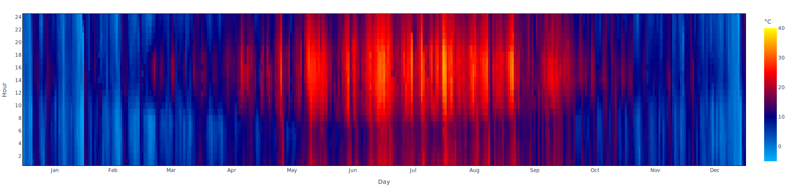
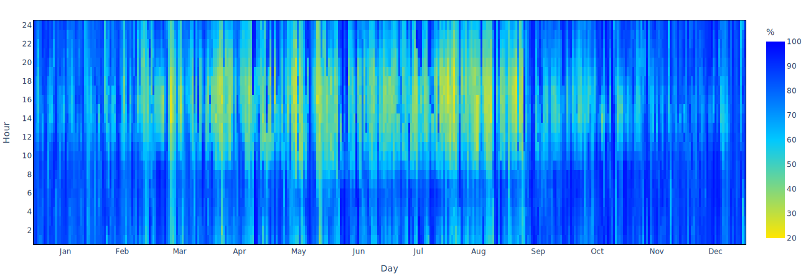

# Temperature and Humidity

The **Temperature and Humidity** tab presents an overview of [air dry bulb temperature](temperatures-explained.md) and [relative humidity](relative-humidity-explained.md) trends.

**Clima** allows the user to visualize the annual data trend through a customizable chart.&#x20;

<figure><figcaption>
Example: annual dry bulb temperatures trend for <strong>Paris, FRA</strong>
</figcaption></figure>

<figure><figcaption>
Example: annual relative humidity trend for <strong>Paris, FRA</strong>
</figcaption></figure>

Daily [scatter plot](https://en.wikipedia.org/wiki/Scatter\_plot) shows all hourly data on all days of the month and the typical monthly trend.

<figure><figcaption>
Example: daily dry bulb temperatures trend for <strong>Paris, FRA</strong>
</figcaption></figure>

<figure><figcaption>
Example: daily relative humidity trend for <strong>Paris, FRA</strong>
</figcaption></figure>

[Heat maps](https://en.wikipedia.org/wiki/Heat\_map) allow the intensity of values to be perceived through color palettes throughout the year.

<figure><figcaption>
Example: annual dry bulb temperatures heatmap for <strong>Paris, FRA</strong>
</figcaption></figure>

<figure><figcaption>
Example: annual relative humidity heatmap for <strong>Paris, FRA</strong>
</figcaption></figure>
