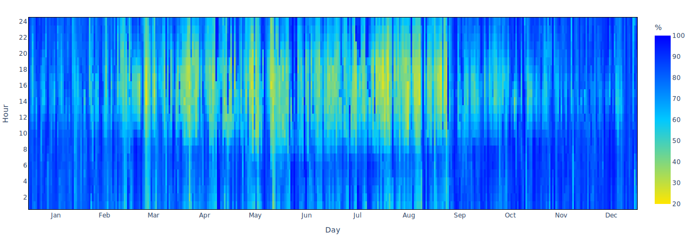

# Relative humidity explained

### Yearly chart

The annual graph allows the relative humidity range in different months to be evaluated. Moreover, overlaying the average value trend for each day helps visualize the differences between the minimum and maximum daily values for the investigated location.

The humidity comfort band is overlaid, considering 30-70% RH the comfortable range. With these trends, climates can be assessed, whether too dry or too humid, then evaluating design solutions that include humidification or dehumidification system.

<figure><figcaption>
Annual relative humidity trend for <strong>Paris, FRA</strong>
</figcaption></figure>

### Daily chart

Monthly [scatterplots](https://en.wikipedia.org/wiki/Scatter\_plot) show all hourly relative humidity. The humidity excursion is much more evident than in the annual graphs. Daily medians, i.e., the most frequently occurring values, help evaluate the outliers.

<figure><figcaption>
Daily relative humidity trend for <strong>Paris, FRA</strong>
</figcaption></figure>

### Heatmap

Heatmap is another very useful method for evaluating relative humidity excursion over a year (by evaluating the horizontal gradient) or over individual days (by evaluating the vertical gradient).

<figure><figcaption>
Annual relative humidity heatmap for <strong>Paris, FRA</strong>
</figcaption></figure>

### Descriptive statistics

The last tool for relative humidity assessment is the statistics table. The earlier graphically made evaluations can be supported by the numbers. The following are listed, for each month:

* the relative humidity means;
* the [standard deviations](https://en.wikipedia.org/wiki/Standard\_deviation);
* the minimum values;
* the [percentiles values](https://en.wikipedia.org/wiki/Percentile) (1%, 25%, 50%, 75%, 99%);
* the maximum values.
