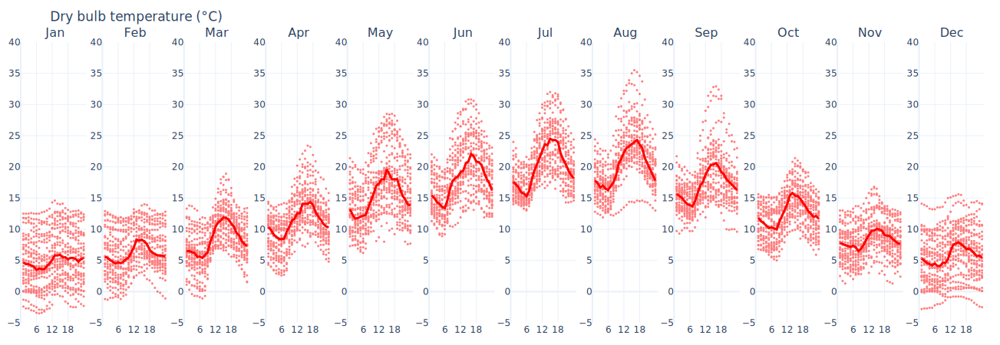

# Temperatures explained

### Yearly chart

The annual graph allows the [dry-bulb temperature ](https://en.wikipedia.org/wiki/Dry-bulb\_temperature)range in different months to be evaluated. Moreover, overlaying the average value trend for each day helps visualize the differences between the minimum and maximum daily values for the investigated location.

Comfortable temperature ranges for 80% and 90% of the population, calculated according to [ASHRAE adaptive comfort](https://en.wikipedia.org/wiki/Thermal\_comfort#Adaptive\_comfort\_model), are overlaid (see also the excellent [CBE Thermal Comfort Tool](https://comfort.cbe.berkeley.edu/)). For each location, it is therefore possible to assess the temperature difference between outdoors and comfort conditions, or to evaluate passive [free cooling](https://en.wikipedia.org/wiki/Free\_cooling) strategies using outside air in the summer season. For more information on [natural ventilation potential, see the dedicated page](../natural-ventilation.md).

<figure><figcaption>
Annual dry bulb temperatures trend for <strong>Paris, FRA</strong>
</figcaption></figure>

### Daily chart

Monthly [scatterplots](https://en.wikipedia.org/wiki/Scatter\_plot) show all hourly temperatures. The temperature excursion is much more evident than in the annual graphs. Daily medians, i.e., the most frequently occurring values, help evaluate the outliers.

<figure><figcaption>
Daily dry bulb temperatures trend for <strong>Paris, FRA</strong>
</figcaption></figure>

### Heatmap

Heatmap is another very useful method for evaluating thermal excursion over a year (by evaluating the horizontal gradient) or over individual days (by evaluating the vertical gradient).

<figure><figcaption>
Annual dry bulb temperatures heatmap for <strong>Paris, FRA</strong>
</figcaption></figure>

### Descriptive statistics

The last tool for temperature assessment is the statistics table. The earlier graphically made evaluations can be supported by the numbers. The following are listed, for each month:

* the temperature means;
* the [standard deviations](https://en.wikipedia.org/wiki/Standard\_deviation);
* the minimum values;
* the [percentiles values](https://en.wikipedia.org/wiki/Percentile) (1%, 25%, 50%, 75%, 99%);
* the maximum values.
