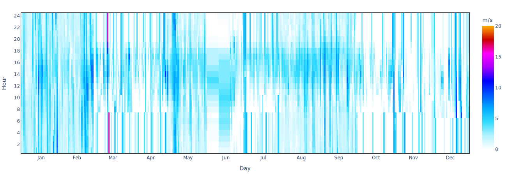
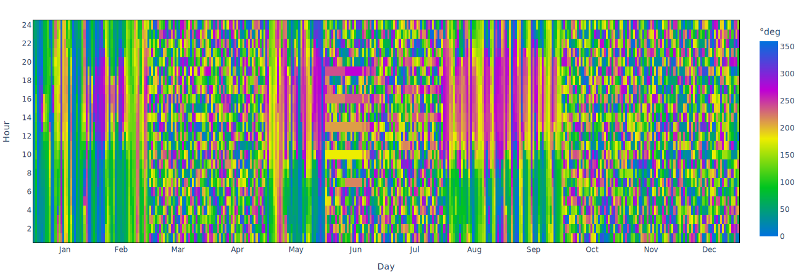

# Wind

The **Wind** tab presents an overview of how to visualize the intensity, frequency, and direction of the wind.

**Clima** allows the user to visualize the annual, seasonal, daily and customizable period wind data in a [wind rose](https://en.wikipedia.org/wiki/Wind\_rose).

<figure><figcaption>
Example: annual wind rose for <strong>Rome, ITA</strong>
</figcaption></figure>

Moreover, **Clima** shows wind intensity and direction using [heat maps](https://en.wikipedia.org/wiki/Heat\_map).

<figure><figcaption>
Example: Heat map of the hourly wind intensity on all days of the year for <strong>Rome, ITA</strong>
</figcaption></figure>

<figure><figcaption>
Example: Heat map of the hourly wind direction on all days of the year for <strong>Rome, ITA</strong>
</figcaption></figure>
