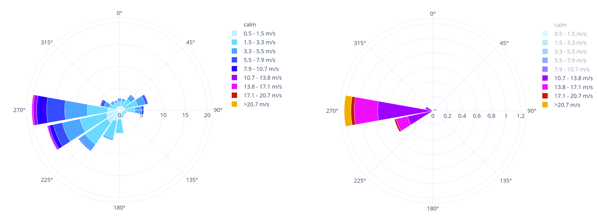

# How to read a Wind Rose

The [wind rose](https://en.wikipedia.org/wiki/Wind\_rose) is used to provide a synthetic overview of [wind speed](https://en.wikipedia.org/wiki/Wind\_speed) and [wind direction](https://en.wikipedia.org/wiki/Wind\_direction) frequency distribution at a given location.

Wind speed can be estimated with several scales. One of the first was created by Britain's Admiral Sir Francis Beaufort (1805). The [Beaufort scale](https://en.wikipedia.org/wiki/Beaufort\_scale) is an empirical scale that relates wind speed to observed conditions at sea or on land. The original scale goes from 0 to 12, but the **Clima Tool** will show the results from 1 to 9 since it is not common to construct buildings in places with recurrent winds over 100 km/h.

<figure><figcaption>
Graphical illustration of the Beaufort scale. The colors shown for each scale value are those used in the tool's charts.                               Source: <a href="https://howtoons.com/The-Beaufort-Scale">howtoons</a>
</figcaption></figure>

Each circle segment shows the winds according to the cardinal direction along which they blow from.

<figure><figcaption>
<a href="https://en.wikipedia.org/wiki/Geographic_coordinate_system">Geographical coordinates</a> in the wind rose
</figcaption></figure>

The length of each radius around the circle shows how often the wind blew from that direction. A click of the mouse over each slice of the rose shows therefore the recurrence frequency in which the wind of such intensity is repeated over the analyzed period.

<figure><figcaption>
Frequency of wind intensity recurrence in the wind rose
</figcaption></figure>

As most graphs in **Clima Tool**, the wind rose is strongly interactive. Clicking on the legend will hide or highlight the selected category. As such, it is easy to go from a wind rose showing all the wind directions and frequency to one that highlights only the selected speed range. This can be particularly useful to identify low-frequency, high-speed wind patterns.&#x20;

<figure><figcaption>
Left: wind rose showing all velocity ranges Right: the same data can be easily filtered (by clicking on the legend) to show only direction and frequency of wind speeds above 10.7m/s
</figcaption></figure>

In the seasonal graphs section, **Clima** shows 4 wind roses for the periods of:

* December - February;
* March - May;
* June - August;
* September - December.

Personal viewing periods are available using the last portion of the Wind section, where a wind rose of the desired interval can be generated.

In building design, the wind is addressed in several forms:

* assessing pedestrian and outdoor comfort;
* design for wind-driven natural ventilation;
* understanding pollution dispersal and outdoor air quality;
* in warm climates, thoughtful design of indoor patios or wind towers can provide naturally mitigated environments;
* in renewable energy, wind data are used to design wind turbines;
* in structural analysis, wind load considerably influences the design of roofs, sheds, or overhanging elements.
